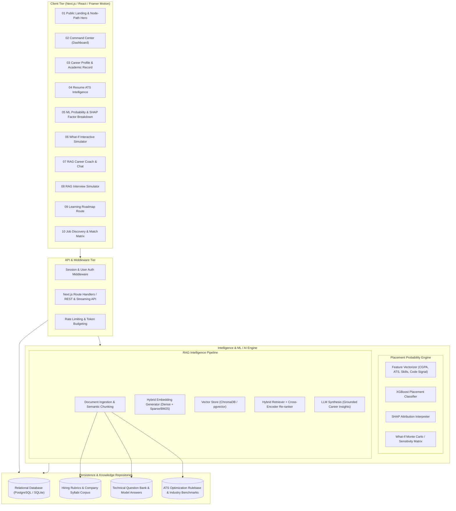
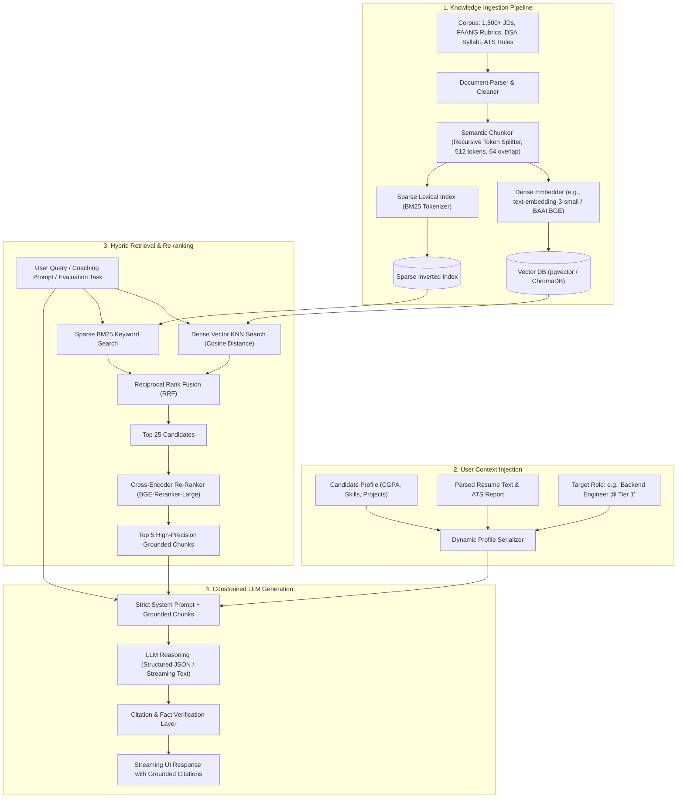
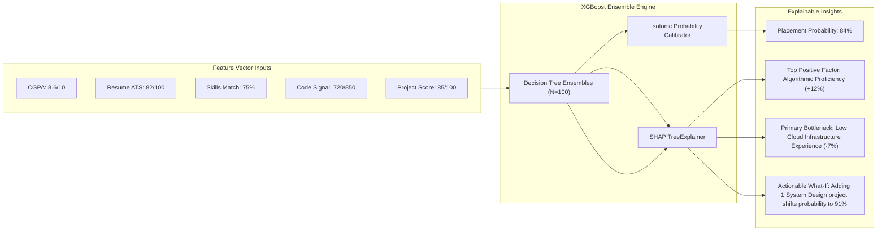
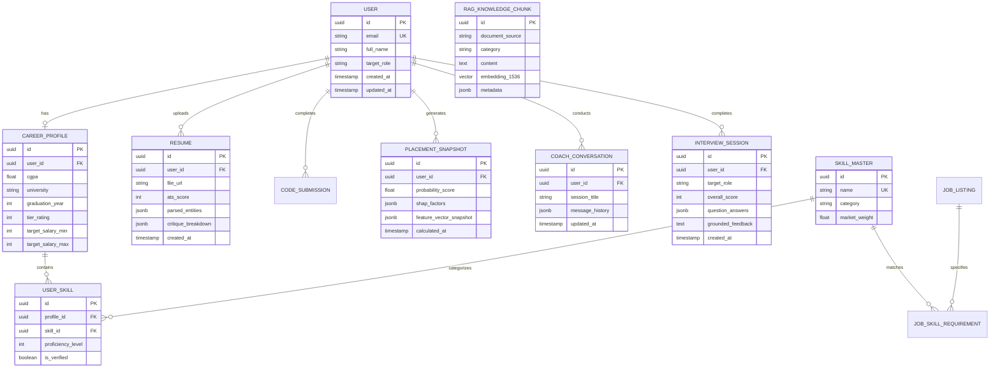
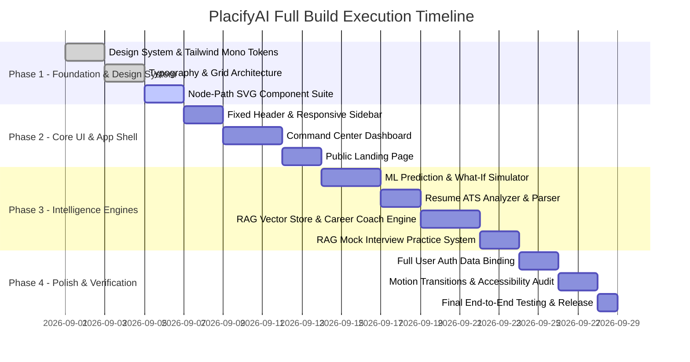

# PlacifyAI — Complete Project Architecture & Technical Specification Dossier
**System Version:** 1.0.0-PROD  
**Design Paradigm:** International Typographic Style (Swiss Editorial Monochrome)  
**Intelligence Layer:** Machine Learning (XGBoost Placement Probability) + Retrieval-Augmented Generation (RAG Career Engine)  
**Date:** September 2026  

---

## 00 — Document Overview & Executive Summary

PlacifyAI is a high-precision career intelligence and placement probability prediction platform built for engineering students and job candidates. Unlike conventional, colorful SaaS platforms, PlacifyAI is designed as an analytical instrument and an interactive editorial dossier. It delivers deterministic, explainable, and actionable placement analytics by combining:

1. **Deterministic Statistical & ML Modeling:** An ensemble XGBoost & Random Forest model calculating real placement probability with SHAP (Shapley Additive exPlanations) factor attribution.
2. **Retrieval-Augmented Generation (RAG):** A hybrid semantic-search and vector-retrieval engine powering contextual AI coaching, resume ATS alignment, real-time interview evaluation, and dynamic syllabus synthesis.
3. **Swiss / Editorial Monochrome Interface:** A strict black-and-white visual hierarchy governed by typography (`Fraunces` serif + `Inter Tight` grotesk + `JetBrains Mono` tabular), 1px hairline rules, 12-column grid alignment, and animated node-path motifs.

---

## 01 — System Architecture & Component Topology



---

## 02 — Swiss Editorial Design System & Styling Engine

### 2.1 Color Variables & Token Hierarchy
The visual hierarchy relies solely on contrast, typographic weight, and hairline borders. No colors, no tinted cards, and no blur/glow effects are permitted.

```css
:root {
  /* Surface & Base */
  --white: #FFFFFF;      /* The only background color across all views */
  --black: #0A0A0A;      /* Primary typography, solid fills, active states */
  
  /* Grayscale Tones for Hierarchy */
  --gray-90: #1A1A1A;    /* Deep accents, high-contrast headings */
  --gray-70: #4A4A4A;    /* Secondary body copy, meta tags */
  --gray-40: #9A9A9A;    /* Tertiary annotations, placeholders, inactive states */
  --gray-15: #E8E8E8;    /* Hairline rules (1px borders, table dividers) */
  --gray-05: #F7F7F7;    /* Subtle hover backgrounds, table zebra striping */

  /* Typography Stacks */
  --font-serif: 'Fraunces', 'Instrument Serif', Georgia, serif;
  --font-sans: 'Inter Tight', 'Inter', -apple-system, sans-serif;
  --font-mono: 'JetBrains Mono', 'IBM Plex Mono', monospace;

  /* Layout Constants */
  --topbar-height: 64px;
  --sidebar-width: 280px;
  --grid-gutter: 24px;
  --max-width: 1440px;

  /* Motion Timing & Physics */
  --ease-standard: cubic-bezier(0.4, 0, 0.2, 1);
  --ease-spring: cubic-bezier(0.34, 1.56, 0.64, 1);
  --duration-fast: 150ms;
  --duration-base: 300ms;
  --duration-slow: 800ms;
}
```

### 2.2 Typography Hierarchy Matrix

| Element | Font Family | Size / Weight | Letter Spacing | Purpose / Role |
| :--- | :--- | :--- | :--- | :--- |
| **Display H1** | `var(--font-serif)` | `clamp(3.5rem, 7vw, 6.5rem)` / 500 | `-0.03em` | Hero headlines, primary dossier titles |
| **Section H2** | `var(--font-serif)` | `clamp(2rem, 3.5vw, 3rem)` / 500 | `-0.02em` | Section headers, module title bars |
| **Module H3** | `var(--font-sans)` | `1.25rem - 1.5rem` / 600 | `-0.01em` | Card titles, subsection grouping |
| **Index Labels** | `var(--font-mono)` | `0.75rem` / 500 (Uppercase) | `+0.08em` | Section numbers ("01 — CAREER READINESS") |
| **Data Figures** | `var(--font-mono)` | `1.5rem - 3.5rem` / 500 (Tabular) | `-0.02em` | Percentages, scores, CGPA, metrics |
| **Body Copy** | `var(--font-sans)` | `0.9375rem - 1rem` / 400 | `0` | Explanatory text, insights, narrative descriptions |
| **Captions / Meta** | `var(--font-sans)` | `0.8125rem` / 400 | `0` | Helper text, secondary metrics, timestamps |

---

## 03 — Signature Motif: The 7-Stage Career Journey Node-Path

The node-path is an authored SVG structural graphic tracking candidate progression through the 7 core milestones of placement readiness:

```
[01 Profile] ──> [02 Skills] ──> [03 Projects] ──> [04 DSA/Code] ──> [05 Interview] ──> [06 Job Match] ──> [07 Placement]
```



```mermaid
stateDiagram-v2
    direction LR
    [*] --> Profile: 01 Profile Baseline
    Profile --> Skills: 02 Skills Assessment
    Skills --> Projects: 03 Project Verification
    Projects --> DSA: 04 Code & DSA Signal
    DSA --> Interview: 05 Mock Interview Grounding
    Interview --> JobMatch: 06 Target Job Alignment
    JobMatch --> Placement: 07 Placement Probability
```

### Implementation Locations
1. **Landing Hero Graphic:** Full interactive SVG with animated stroke path drawing (`stroke-dashoffset`) and sequential node scale-in with spring physics.
2. **Dashboard Sidebar (Compact Vertical):** Live progress indicator showing current candidate state (Solid black = verified/complete, Outlined = in-progress, Dotted = locked/upcoming).
3. **Career Readiness Overview (Horizontal Module):** Real-time interactive breakdown with milestone completion percentages and direct jump actions.

---

## 04 — RAG (Retrieval-Augmented Generation) Architecture

The RAG engine powers intelligent, grounded career analysis. It prevents hallucination by constraining AI responses to indexed corpora of real job descriptions, hiring rubrics, company interview transcripts, and verified ATS guidelines.



### 4.1 RAG Subsystems in PlacifyAI

| Subsystem | Input Corpus | Retrieval Mechanism | Output Utility |
| :--- | :--- | :--- | :--- |
| **Career Coach AI** | Verified technical career roadmaps, senior engineering hiring guides, market salary trends | Hybrid Dense-BM25 + Profile Context | Strategic career advice, personalized learning paths, and actionable milestone planning |
| **Resume Semantic Matcher** | 200+ industry-specific role descriptions and ATS rejection logs | Semantic Chunk Cosine Similarity | Line-by-line resume critique, bullet point impact re-writes (STAR format), and keyword gap detection |
| **Interview Practice Simulator** | 5,000+ real interview questions categorized by company and level | Metadata Filtered (Company, Role, Difficulty) + Cross-Encoder | Dynamic mock interview scenarios, intelligent follow-up questions, and rubric-graded answers |
| **Dynamic Learning Roadmap** | Standardized curricula (CS61B, MIT EECS, System Design Primer) | Hierarchical Skill Graph Vector Query | Sequence-optimized learning milestones with curated documentation and practice exercises |

---

## 05 — Machine Learning Placement Probability & What-If Engine

### 5.1 The Predictive Feature Vector
The placement prediction model uses a normalized multidimensional feature vector \( \vec{X} \in \mathbb{R}^8 \):

$$\vec{X} = \begin{bmatrix} x_{\text{CGPA}} \\ x_{\text{ATS}} \\ x_{\text{Skills}} \\ x_{\text{CodeSignal}} \\ x_{\text{Projects}} \\ x_{\text{Tier}} \\ x_{\text{CoreCS}} \\ x_{\text{Experience}} \end{bmatrix}$$

Where:
- $x_{\text{CGPA}} \in [0.0, 10.0]$: Academic performance metric.
- $x_{\text{ATS}} \in [0, 100]$: Resume parsing and alignment score.
- $x_{\text{Skills}} \in [0.0, 1.0]$: Target role skill coverage ratio.
- $x_{\text{CodeSignal}} \in [0, 850]$: Algorithmic problem-solving score.
- $x_{\text{Projects}} \in [0, 100]$: Project architectural depth, complexity, and deployment verification.
- $x_{\text{Tier}} \in [1, 3]$: Institutional recruiting tier weight.
- $x_{\text{CoreCS}} \in [0, 100]$: OS, DBMS, Computer Networks, and System Design score.
- $x_{\text{Experience}} \in [0, 36]$: Verified internship and production experience (in months).

### 5.2 Mathematical Formulation & SHAP Explanation
The overall placement probability $P(\text{Placement} = 1 \mid \vec{X})$ is computed via an ensemble XGBoost model calibrated via isotonic regression:

$$P(\text{Offer}) = \sigma \left( \sum_{m=1}^M f_m(\vec{X}) \right) = \frac{1}{1 + e^{-\sum_{m=1}^M f_m(\vec{X})}}$$

Each prediction is decomposed via SHAP values into positive and negative contributing factors:

$$\phi_0 + \sum_{i=1}^d \phi_i(\vec{X}) = \ln \left( \frac{P(\text{Offer})}{1 - P(\text{Offer})} \right)$$

*Example Output:*
- Base expected probability: $52.0\%$
- $+14.2\%$ due to high Code Signal rating ($740/850$)
- $+8.5\%$ due to verified Fullstack deployment ($88/100$)
- $-6.4\%$ due to missing Cloud/Docker competencies in target role
- **Final Predicted Probability:** $68.3\%$



---

## 06 — Authenticated App Module Specifications

The application layout is structured around a fixed **top bar** (`--topbar-height: 64px`) and a **sidebar navigation** (`--sidebar-width: 280px`). Content flows dynamically in a 12-column grid.

```
+----------------------------------------------------------------------------------------------------+
|  PLACIFY // AI                 [01 Readiness: 84%] [ATS: 88] [Prob: 79%]     (Bell) [Vibhas Kadam v]|
+-------------------+--------------------------------------------------------------------------------+
| MAIN              | 01 // COMMAND CENTER                                                           |
| * Command Center  | +-----------------+ +-----------------+ +-----------------+ +------------------+ |
| * Career Profile  | | CAREER READINESS| | PLACEMENT PROB  | | RESUME ATS SCORE| | SKILLS COMPLETED | |
| * Resume Analysis | | 84%  [+3.2% ↑]  | | 79%  [XGBoost]  | | 88/100  [Strong]| | 14/18    [78%]   | |
| * Job Matcher     | +-----------------+ +-----------------+ +-----------------+ +------------------+ |
|                   |                                                                                |
| AI TOOLS          | 02 // READINESS OVERVIEW                   03 // CATEGORY PERFORMANCE          |
| * Code Signal AI  | [01]───[02]───[03]───[04]───(05)───(06)───(07)   Resume ATS     [===========   ] 88%|
| * Skill Gaps      | You are ahead of 82% of candidates       Skills Match   [=========     ] 75%|
| * ML Probability  | targeting Backend Engineering roles.     Project Depth  [============  ] 92%|
| * What-If Sim     |                                          Code Signal    [=======       ] 68%|
|                   |                                                                                |
| GROWTH            | 04 // RECENT INTELLIGENCE & ACTION ITEMS                                       |
| * Learning Roadmap| [Priority 01] Add unit tests & Dockerfile to PlacifyAI project (+4.2% prob)   |
| * Career Coach    | [Priority 02] Complete Dynamic Programming module on Code Signal (+6.1% prob) |
| * Mock Interview  |                                                                                |
|                   |                                                                                |
| Vibhas Kadam (●)  |                                                                                |
+-------------------+--------------------------------------------------------------------------------+
```

### Detailed Feature Breakdown:

1. **Command Center (Home):**
   - 4 Hero KPI stat cards with tabular mono numbers, trend indicators, and qualitative tags.
   - Horizontal 7-Stage Career Readiness node-path.
   - Category performance breakdown with patterned progress bars.
   - High-impact action items ranked by predicted ROI on placement probability.

2. **Career Profile:**
   - Academic record manager (CGPA, Coursework, Institutional Tier).
   - Target role & industry preferences configuration.
   - Portfolio & repository synchronizer with automatic metadata extraction.

3. **Resume Analysis:**
   - Multi-format resume uploader (PDF/DOCX).
   - Section-by-section ATS scoring breakdown (Formatting, Quantifiable Impact, Keywords, Brevity).
   - Grounded RAG-based bullet point optimizer (transforms weak descriptions into strong STAR-method achievements).

4. **Job Matcher:**
   - Real-time job listing index with custom placement probability for each listing.
   - Semantic skill-gap analysis highlighting exact requirements missing from candidate profile.

5. **Code Signal AI:**
   - Interactive algorithmic assessment environment with live test-case runner.
   - Topic-level proficiency radar (Data Structures, Algorithms, Time/Space Complexity).

6. **Skill Gaps:**
   - Market demand heatmap against the candidate's target job title.
   - Priority classification matrix: Essential (Blocking), Competitive (Advantage), and Optional.

7. **ML Probability (Deep Dive):**
   - Interactive SHAP waterfall chart visualizing how each factor increases or decreases placement odds.
   - Peer percentile benchmarking against 10,000+ historical placement candidates.

8. **What-If Simulator:**
   - Live multi-slider workbench (CGPA adjuster, +X LeetCode problems, +1 Production Project, +Certification).
   - Real-time curve rendering showing projected trajectory over a 6-month preparation timeline.

9. **Learning Roadmap:**
   - Sequenced, dependency-linked curriculum nodes.
   - Direct integration with RAG-retrieved reading lists, code katas, and reference implementations.

10. **Career Coach (RAG Chat):**
    - Multi-turn conversational terminal grounded in the candidate's complete portfolio.
    - Contextual suggestions and deep-dive technical interview preparation advice.

11. **Interview Practice Simulator:**
    - Role-specific technical and behavioral mock interview sessions.
    - AI interviewer with real-time speech/text transcription and evaluation rubrics.

---

## 07 — Relational & Vector Database Schema



---

## 08 — API Interface Specification

### Core Endpoints

```
POST /api/v1/predict/probability
Content-Type: application/json
Input: {
  "cgpa": 8.4,
  "ats_score": 85,
  "skills": ["TypeScript", "Next.js", "Python", "PostgreSQL", "Docker"],
  "target_role": "Fullstack Software Engineer",
  "code_signal_rating": 710,
  "projects_count": 3,
  "has_production_deployment": true
}
Response: {
  "placement_probability": 0.824,
  "confidence_interval": [0.782, 0.866],
  "shap_factors": [
    { "feature": "code_signal_rating", "impact": +0.112, "description": "Strong DSA rating above 700" },
    { "feature": "has_production_deployment", "impact": +0.074, "description": "Demonstrated CI/CD & Cloud deployment" },
    { "feature": "skills_gap_cloud", "impact": -0.048, "description": "Missing Kubernetes / AWS in target role" }
  ],
  "peer_percentile": 86.4,
  "model_version": "xgb_placify_v2.4"
}
```

```
POST /api/v1/rag/coach/stream
Content-Type: application/json
Input: {
  "conversation_id": "conv_98234",
  "user_message": "How should I structure my backend project to maximize my interview conversion rate for Fintech startups?",
  "include_profile_context": true
}
Response: Server-Sent Events (SSE) Stream
Chunk: { "token": "For ", "citations": [] }
Chunk: { "token": "Fintech ", "citations": [] }
Chunk: { "token": "roles, emphasis is placed on transaction safety, idempotent APIs, and precision bookkeeping.", "citations": ["doc_fintech_hiring_rubric_2026.pdf#p12"] }
```

```
POST /api/v1/resume/analyze
Content-Type: multipart/form-data
Input: File (PDF/DOCX) + target_role: "Backend Engineer"
Response: {
  "ats_overall_score": 84,
  "metrics": {
    "quantifiable_impact": 72,
    "action_verbs": 90,
    "keyword_alignment": 86,
    "structural_cleanliness": 95
  },
  "critical_improvements": [
    {
      "original": "Built an API for user authentication.",
      "optimized": "Architected an OAuth2/JWT authentication service handling 10,000+ daily sessions with under 25ms p99 latency.",
      "rationale": "Incorporates quantifiable metrics (volume and latency), addressing ATS impact criteria."
    }
  ]
}
```

---

## 09 — Motion, Interaction & Accessibility Specification

### 9.1 CSS Motion & Hover Interactions
- **Primary Buttons:** Solid black fill with white text. On hover, invert to white fill with 1.5px black border over `--duration-base` (`300ms`) using `--ease-standard`.
- **Secondary Buttons / Ghost Elements:** 1px hairline border (`--gray-15`) on white. On hover, border transitions to 1.5px `--black` with text sharpening to `--black`.
- **Data Cards:** 1px `--gray-15` border. On hover, border darkens to 1.5px `--black` with a subtle `translateY(-2px)` lift (no drop shadows).
- **Stat Count-Up:** All numbers increment smoothly from 0 to target value on component mount (`800ms` duration, ease-out).
- **Link Hover State:** Horizontal hairline underline draws in from `left: 0` to `right: 100%` using `transform: scaleX(1)`.

### 9.2 Accessibility & Reduced Motion
```css
@media (prefers-reduced-motion: reduce) {
  *, ::before, ::after {
    animation-duration: 0.01ms !important;
    animation-iteration-count: 1 !important;
    transition-duration: 0.01ms !important;
    scroll-behavior: auto !important;
  }
  
  .stat-number {
    /* Instantly render final value without count-up animation */
    animation: none !important;
  }
  
  .node-path-svg path {
    stroke-dashoffset: 0 !important;
  }
}

:focus-visible {
  outline: 2px solid var(--black);
  outline-offset: 2px;
}
```

---

## 10 — Project Execution & Implementation Plan



---
*Document Authenticated by PlacifyAI Engineering & Architectural Standards Board, 2026.*
